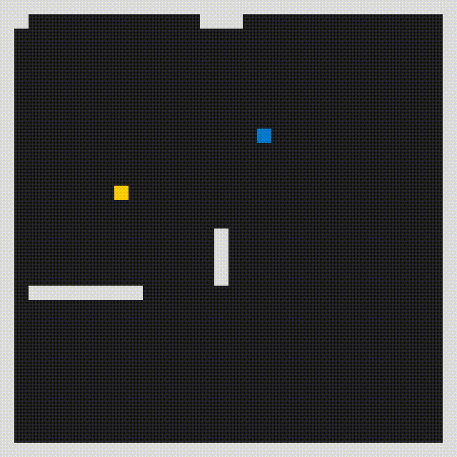
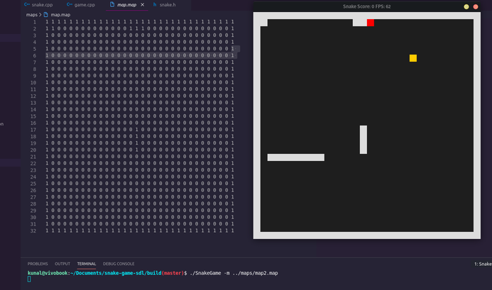

# Snake Game using libsdl2

Extended snake game to support custom maps and ability to create maps using tilemaps.

## What's new?

* You can now create custom maps for the game.
* The map is saved in a text file.
* The map is a 32x32 grid of elements.
* Each element in the map is a 0 or 1 which represent a block of a maze and blank space respectivly.
* See running instructions for steps on how to load a custom created map.
* The map directory contains a couple of example maps. If no map is specefied the game will load map.map from map directory by default.
* If no map is specefied normal game will start without any maze.

## Dependencies for Running Locally
* cmake >= 3.7
  * All OSes: [click here for installation instructions](https://cmake.org/install/)
* make >= 4.1 (Linux, Mac), 3.81 (Windows)
  * Linux: make is installed by default on most Linux distros
  * Mac: [install Xcode command line tools to get make](https://developer.apple.com/xcode/features/)
  * Windows: [Click here for installation instructions](http://gnuwin32.sourceforge.net/packages/make.htm)
* SDL2 >= 2.0
  * All installation instructions can be found [here](https://wiki.libsdl.org/Installation)
  * Note that for Linux, an `apt` or `apt-get` installation is preferred to building from source.
* gcc/g++ >= 5.4
  * Linux: gcc / g++ is installed by default on most Linux distros
  * Mac: same deal as make - [install Xcode command line tools](https://developer.apple.com/xcode/features/)
  * Windows: recommend using [MinGW](http://www.mingw.org/)

## Basic Build Instructions

1. Clone this repo.
2. Make a build directory in the top level directory: `mkdir build && cd build`
3. Compile: `cmake .. && make`

## Running

1. Run it: `./SnakeGame`.
2. You can specify a map file using `-m ` flag and spcefiy a .map file.
    
    Example: `./SnakeGame -m ../maps/map2.map`

## Rubric points covered

| Point                                                                                          | is Covered |
|------------------------------------------------------------------------------------------------|------------|
| The project demonstrates an understanding of C++ functions and control structures.             | yes        |
| The project reads data from a file and process the data, or the program writes data to a file. | yes [map is loaded from a file saved in disk] |
| The project accepts user input and processes the input.| yes [accepts user input for map file path]|
| The project uses Object Oriented Programming techniques.| yes|
|Classes use appropriate access specifiers for class members.|yes [each member is marked explicitly in map class in map.h]|
|Class constructors utilize member initialization lists.|yes [map path is passed using initializer list]|
|Classes encapsulate behavior.| yes [map class encapsulates all map related behavior]|
|The project makes use of references in function declarations.| yes [renderer is passed using reference]|
|The project uses move semantics to move data, instead of copying it, where possible.|  yes [std::move is used to move an rvalue in game.cpp]|
